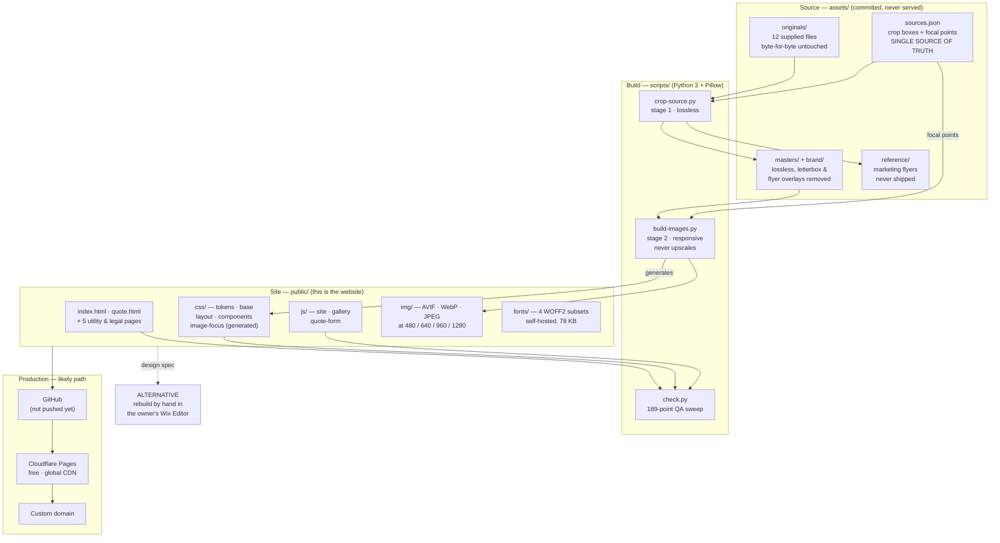

# B.O.S. Trucking & Site, Inc. — Website

Website for **B.O.S. Trucking & Site, Inc.**, Fort Myers, Florida.
Bulk material delivery, tri-axle dump truck hauling, and secure truck parking & storage.

Plain static HTML, CSS and JavaScript. No framework, no bundler, no build step for the
markup. Open it and it works.

```
npm start          →  http://localhost:8080
```

### 🔗 Temporary review URL

**https://aldhairmartinez.github.io/bos-trucking/**

Public GitHub Pages hosting so the business owner can review the site. It is deliberately
`noindex, nofollow` with `robots.txt` set to `Disallow: /`, so it cannot compete with the
live Wix site in search results or create duplicate-content problems. **Not the final
home** — see [`docs/deployment.md`](docs/deployment.md).

---

## 1. The business

| | |
|---|---|
| Legal name | B.O.S. Trucking & Site, Inc. |
| Phone / text | **239-900-6374** |
| Email | bostruckingsite@gmail.com |
| Yard | 2604 Market St, Fort Myers, FL 33916 |
| Service area | Fort Myers · Lee County · Southwest Florida |
| USDOT | 1418170 |
| Current site | https://bostruckingsite.wixsite.com/mysite (Wix, free plan) |

**Services** — Material delivery · Tri-axle dump truck hauling · Truck parking & storage

**Published parking rates** — $75/mo under 20 ft · $140/mo 20–30 ft · $200/mo 30 ft +
Always shown with the owner's verbatim disclaimer: *"Rates are based on overall vehicle
size. Final pricing, vehicle acceptance, and space assignment are subject to management
discretion."*

Every fact on the site traces to the existing website or the owner's supplied marketing
materials. See [`docs/content-inventory.md`](docs/content-inventory.md) for the fact-by-fact
sourcing, and the list of things we deliberately do **not** claim.

---

## 2. Architecture



Full detail: [`docs/architecture.md`](docs/architecture.md).

### Why plain static files

This is a seven-page brochure site for a local service business whose single most
important interaction is *tapping a phone number*. A framework would add build steps,
dependency upkeep and hydration cost without improving any of that. The whole shell —
HTML, CSS, JS and fonts — is about **150 KB**, and the site works with JavaScript
disabled.

---

## 3. Local development

Requires **Python 3** (preinstalled on macOS). There are no runtime or build
dependencies and no `node_modules`; `npm` is only a familiar task runner.

```bash
npm start              # local preview at http://localhost:8080
npm run check          # link, asset, a11y, SEO and contact-detail checks
npm run images         # regenerate public/img/** from assets/sources.json
```

Or without npm at all:

```bash
python3 scripts/serve.py 8080
python3 scripts/check.py
```

The dev server adds two things bare `http.server` lacks: correct MIME types for
`.avif` / `.webp` / `.woff2`, and clean URLs with a real 404 — so `/quote` resolves and
unknown paths serve the branded `404.html` with a 404 status, matching Cloudflare Pages.

The image pipeline needs Pillow (only `scripts/` touches it):

```bash
python3 -m pip install --user Pillow
```

---

## 4. Asset organisation

```
assets/
  sources.json          ← SINGLE SOURCE OF TRUTH for every image
  originals/            ← the 12 supplied files, byte-for-byte untouched
  masters/              ← lossless crops: letterbox bars + flyer overlays removed
  brand/                ← logo art, black backing plate keyed to transparent
  reference/            ← marketing flyers, for reference only, never shipped
public/img/             ← the only images the browser ever sees
```

### The originals are never modified

`assets/originals/` holds all twelve supplied files with their original names and bytes.
`scripts/crop-source.py` only ever reads from it. Verify any time:

```bash
cmp assets/originals/IMG_0653.PNG <path-to-owner-copy>
```

### Swapping in the owner's high-resolution photos

**Today's images are temporary.** All twelve supplied files are 1290×2796 iPhone
screenshots whose real content is a band in the middle, so output tops out near 1290 px
wide. Nothing about the design depends on that.

The HTML never references a camera filename — only stable logical IDs. So replacing a
photo touches **one file** and requires **no redesign**:

```jsonc
// assets/sources.json
"bos-mack-dump-truck": {
  "file": "incoming/mack-granite-tri-axle.jpg",   // 1. was originals/IMG_0653.PNG
  "crop": null,                                   // 2. a real original has no bars
  "focus": [0.44, 0.52]                           // 3. nudge if the subject moved
}
```

```bash
npm run images && npm run check && npm start
```

The pipeline never upscales, so the ladder currently stops at 1280. The markup already
requests 1600 / 1920 / 2560 — those rungs appear **automatically** the moment a real
original lands. Step-by-step walkthrough: [`docs/swapping-images.md`](docs/swapping-images.md).

### Which photographs are used where

Five real photographs, two logo assets, zero stock, zero AI imagery.
Mapping and the full audit: [`docs/asset-inventory.md`](docs/asset-inventory.md).

---

## 5. Deployment

**Likely production path: GitHub → Cloudflare Pages → custom domain.**
`public/` is already a valid Cloudflare Pages site with no build command and no config.

**Alternative: rebuild by hand in the owner's existing Wix Editor**, using this site as
the design specification. Our HTML/CSS cannot be deployed *into* a classic Wix Editor
site — that constraint is real and documented.

Both paths, with costs and trade-offs: [`docs/deployment.md`](docs/deployment.md).
Nothing has been deployed anywhere, and nothing has been pushed to GitHub.

---

## 6. Wix integration

The existing site is on the **free plan** using the **classic Wix Editor** (not Wix
Studio, not responsive) — verified from the live page payload, not assumed.

Three findings that shape everything:

1. **The live parking "Buy Now" buttons cannot take money.** The free plan cannot accept
   online payments, and Wix Pricing Plans has no offline-payment mode. Every customer
   who clicks them dead-ends. Most urgent fix.
2. **Git Integration & Wix CLI puts the Wix Editor into read-only mode** and only
   version-controls Velo code, not layout. It does not solve deployment and costs the
   owner their visual editor.
3. **A classic Editor site cannot be migrated to Wix Studio** — only rebuilt. A Studio
   branch requires Premium to create and a Studio plan to publish.

Research, citations and the tomorrow checklist: [`docs/wix-setup.md`](docs/wix-setup.md).

---

## 7. Security

- **No secrets in this repository.** Everything here is written assuming the repo becomes
  public. `.gitignore` excludes `.env*`, keys, tokens, and Wix / Stripe / Cloudflare
  local state.
- **No `.env.example`** — nothing in the site needs a secret yet. One gets added only
  when a form backend is actually wired, and with placeholders only.
- **No payment handling.** The site never collects, stores, transmits or logs a card
  number, CVV or PAN. See §8.
- **No third-party requests.** Fonts and images are self-hosted; there are no analytics,
  tag managers, ad pixels or external scripts. The only outbound links are `tel:`,
  `sms:`, `mailto:` and Google Maps, all user-initiated.
- **No form backend yet.** The forms validate and then say so plainly rather than
  pretending to send. See [`docs/forms.md`](docs/forms.md).
- `rel="noopener"` on every `target="_blank"`; a honeypot field on both forms.
- Only published business contact details appear in the repo. No personal data.

Before every commit: `git status`, `git diff`, scan for secrets, then `npm run check`.

---

## 8. Future payment integration

**Not implemented, by instruction** — we do not yet know how the owner currently accepts
payment. Parking uses **Check Availability / Call / Text / Contact** CTAs only.

When it is time, the constraint is unavoidable: accepting payment needs either a paid Wix
plan *or* an off-Wix hosted checkout. The recommended interim is **Stripe Payment Links**
— a plain outbound link, so it works even from a free Wix site, with Stripe hosting the
card form (PCI SAQ-A). We never touch card data.

Research, options, costs and the PCI boundary: [`docs/payments.md`](docs/payments.md).

---

## ☑️ TOMORROW: WIX DEPLOYMENT

Do these in order once logged into the owner's Wix account.
Full click-paths in [`docs/wix-setup.md`](docs/wix-setup.md).

### Phase 0 — Before touching anything (15 min)

- [ ] **Confirm the plan.** Dashboard → is the site Free or Premium? Our audit says
      **Free** (`isPremium: false` on the live payload). Everything below forks on this.
- [ ] **Confirm the editor.** Is it the classic **Wix Editor** or **Wix Studio**? Our
      audit says classic Editor (`isResponsive: false`). Studio changes the options.
- [ ] **Save a restore point.** Site → Site History → name a version
      `pre-redesign-<date>`. Do this before any edit.
- [ ] **Screenshot the current homepage** (desktop + mobile) for before/after.
- [ ] **Do NOT connect GitHub from inside Wix.** It puts the editor in permanent
      read-only mode and does not deploy our HTML. Confirmed in Wix's own docs.

### Phase 1 — Fix what is actively broken (30 min) 🔴

- [ ] **Disable the parking "Buy Now" buttons.** They cannot take money on a free plan
      and Pricing Plans has no offline mode, so every click dead-ends today. Either
      unpublish the Pricing Plans page or swap each button to **Check Availability**
      pointing at the quote form.
- [ ] **Fix the four default page URLs.** Pages & Menu → each page → SEO basics → URL
      slug:
      - `/blank` → `/privacy-policy`
      - `/blank-1` → `/accessibility-statement`
      - `/blank-2` → `/terms-and-conditions`
      - `/blank-3` → `/refund-policy`
      Add 301 redirects from the old slugs (Marketing & SEO → URL Redirect Manager).
- [ ] **Remove the unused Wix Bookings app** (installed, not used — dead weight).
- [ ] **Verify where quote submissions land.** Dashboard → Forms & Submissions. Send a
      test and confirm the email notification arrives at the owner's inbox.

### Phase 2 — Decide the path (owner conversation) 🟡

- [ ] Ask the owner the questions in **"Verify with the owner"** below.
- [ ] Choose: **(A)** rebuild by hand in the Wix Editor, free, owner keeps the visual
      editor, ~70% design fidelity; or **(E)** GitHub → Cloudflare Pages, free, 100%
      fidelity, owner gives up the Wix editor. See `docs/deployment.md`.
- [ ] If the owner wants a custom domain and no Wix ad banner, price the Wix upgrade
      against Cloudflare Pages + a ~$10/yr domain.

### Phase 3 — If path A, rebuild in Wix (half day)

- [ ] Set the site palette to the tokens in [`docs/design-system.md`](docs/design-system.md)
      (`#0A0A0A`, `#141414`, `#F8B804`, `#FFFFFF`, `#B5B5B0`).
- [ ] Check whether **Barlow Condensed** and **Inter** are in the Wix font picker. If
      not, substitute from Wix's library and record the swap in `docs/design-system.md`.
      Custom font upload may be premium-gated — verify, do not assume.
- [ ] Upload `public/img/**` to the Wix Media Manager (the optimised derivatives, not
      the originals).
- [ ] Rebuild each section against the local site, pasting copy from
      [`docs/copy-deck.md`](docs/copy-deck.md) — **never retype the pricing disclaimer.**
- [ ] Rebuild both forms field-for-field from [`docs/forms.md`](docs/forms.md).
- [ ] **Lay out the mobile view separately.** The classic Editor has a distinct mobile
      editor; desktop work does not carry over. Enable the mobile Action Bar with
      Call / Text / Quote.
- [ ] Paste the `LocalBusiness` JSON-LD from `public/index.html` into Pages & Menu →
      SEO basics → Advanced SEO → Structured Data Markup (JSON-LD only, ≤5 markups,
      <7,000 chars).
- [ ] Set page titles and meta descriptions from `docs/copy-deck.md`.

### Phase 4 — If path E, ship the static site (1 hour)

- [ ] Get explicit approval, then create the GitHub repo and push.
- [ ] Cloudflare Pages → Connect to Git → build command: *none*, output directory:
      `public`.
- [ ] Connect the custom domain; verify HTTPS.
- [ ] Replace `https://bostruckingsite.com` placeholders in `robots.txt`, `sitemap.xml`,
      and every `canonical` / `og:*` tag with the real domain.
- [ ] Wire the forms (`docs/forms.md`) and send a real test submission.
- [ ] Keep the Wix site live until the new one is verified, then 301 or retire it.

### Phase 5 — Always

- [ ] Google Business Profile: confirm name, address, phone and hours match the site
      exactly.
- [ ] Submit the sitemap in Google Search Console.
- [ ] Run `npm run check` once more. Test a real tap-to-call and tap-to-text **on an
      actual phone**, not an emulator.

---

## Verify with the owner

Nothing below is on the site, because none of it is confirmed.

1. **Original photos and a vector logo.** Biggest single quality upgrade available. The
   twelve supplied files are phone screenshots; we need the real camera files, and the
   logo as SVG / AI / EPS (or ≥2000 px transparent PNG).
2. **Mid parking tier: 20–29 ft or 20–30 ft?** The rates flyer says 20–29; the live site
   says 20–30. We used **20–30** to match what is actually billed in production. A
   vehicle at exactly 29–30 ft is currently ambiguous.
3. **How is parking paid for today?** Cash, check, Zelle, in person, invoice? This
   decides the whole payment plan and whether the Pricing Plans page should exist.
4. **Business / office hours.** Omitted entirely rather than guessed. "24-hour access"
   is used only for the lot, never implying a staffed office.
5. **Facebook and Yelp URLs.** The current site links both; we have no URLs.
6. **Lot access** — gate code, key, or always open? The sign reads
   "AUTHORIZED CLIENTS ONLY".
7. **Minimum delivery quantity and delivery radius.**
8. **Careers** — should CDL hiring appear on the site? Currently nowhere, matching the
   existing site. One quiet footer link is the suggestion.
9. **Legal pages.** Ours are honest placeholders marked as such. The owner already has
   approved Privacy / Accessibility / Terms / Refund text on the live Wix site — use
   that verbatim instead.

---

## Repository map

```
README.md                  this file
package.json               task runner only — no dependencies
.gitignore / .editorconfig

docs/
  architecture.md          how the site is put together and why
  design-system.md         tokens, type scale, components, measured contrast
  asset-inventory.md       all 12 supplied files audited; usage mapping
  content-inventory.md     every fact + its source; what we refuse to claim
  copy-deck.md             paste-ready copy for Wix
  swapping-images.md       replacing screenshots with real originals
  forms.md                 field specs + how to wire submissions
  payments.md              Stripe / Wix research, PCI boundary (not implemented)
  wix-setup.md             Wix platform research + tomorrow's click-paths
  deployment.md            Cloudflare Pages (likely) vs Wix rebuild (alternative)

assets/                    source images — committed, never served
public/                    THE WEBSITE — serve this directory
scripts/
  crop-source.py           stage 1 — lossless masters from untouched originals
  build-images.py          stage 2 — responsive derivatives, never upscales
  serve.py                 local preview with clean URLs and correct MIME types
  check.py                 quality gate — run before every commit
```
