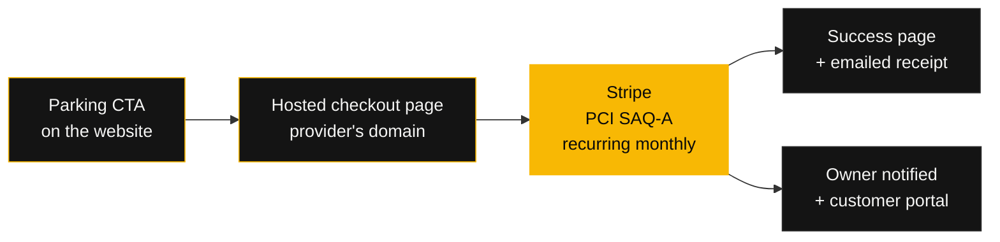

# Payments

## Status: NOT IMPLEMENTED — by instruction

We do not yet know how B.O.S. currently accepts payment for parking. Until the owner tells
us, the site takes no payment and asks for none.

Parking uses **Check Availability**, **Call**, **Text** and the quote form. Nothing else.

---

## 🔴 The live site has a broken payment flow right now

`bostruckingsite.wixsite.com/mysite/pricing-plans/plans-pricing` lists three parking
subscriptions — $75 / $140 / $200 "Every month" — each with **"Add to Cart"** and
**"Buy Now"**.

Those buttons cannot work. Per Wix's own documentation:

- the **free plan cannot accept online payments** at all, and
- *"The manual (offline) payment method is not available with Pricing Plans."*

There is no configuration under which a free-plan Pricing Plans checkout completes. Every
customer who taps "Buy Now" hits a dead end.

**Fix this before anything cosmetic.** Either unpublish that page, or change each button to
**"Check Availability"** pointing at the quote form. It is the first item in the tomorrow
checklist.

---

## The PCI boundary — non-negotiable

> **We never collect, store, process, transmit or log a raw card number, CVV, or full PAN.
> Ever.**

Card entry always happens on the payment provider's own domain, in their hosted page. That
keeps B.O.S. in **PCI DSS SAQ-A**, the lightest compliance scope that exists, and keeps
card data entirely out of this repository, out of any form we build, and out of any log.

Concretely, these are all forbidden in this codebase:

- a `<input name="card_number">` anywhere, under any circumstances
- posting card data to our own endpoint, even over HTTPS
- an iframe we style that *looks* like our checkout but collects card fields we can reach
- logging, echoing, or storing any part of a card number, including the last four

Provider API keys live in the platform's secret store — Wix Secrets Manager, or Cloudflare
environment variables. **Never in Git.** `.gitignore` already excludes `.env*`, `*.key`,
`*.pem`, `.dev.vars` and `.stripe/`.

---

## Target architecture, when the owner is ready

The website's only responsibility is the first arrow: a plain outbound link. Everything
after it belongs to the provider.

---

## Options, costed

### Option 1 — Stripe Payment Links ⭐ recommended interim

Three recurring prices ($75 / $140 / $200 monthly) in the Stripe dashboard, each with a
hosted Payment Link. The site links out to them.

- **Platform cost: $0.** Stripe charges per transaction (verify current US rate).
- **Works from a free Wix site** — it is just an `<a href>`, so no plan upgrade needed.
- Stripe hosts the card form → **SAQ-A**, we touch nothing.
- Native support for monthly subscriptions, receipts, failed-payment retries, and a
  customer portal for cancelling or updating a card.
- No code. No webhook required to start.

**Needs:** the owner's Stripe account and business verification (EIN or SSN, bank
account). That is **credentials and a financial decision → we stop and ask.**

### Option 2 — Upgrade Wix, use native Pricing Plans

- Requires a payment-capable Wix plan (lowest found: Core, **~$29/month** — verify current
  pricing) plus Wix Payments or a connected Stripe account.
- Cleanest if the owner is upgrading anyway: keeps members, subscriptions and billing
  native to the site the owner already knows.
- Makes the three plans that are **already built** on the live site actually function.

### Option 3 — No online payment

- **$0.** "Call to reserve your space."
- Entirely honest, and quite possibly what the owner already does. Many small lots run on
  cash, check or Zelle and have no interest in changing.
- This is the current state of our site.

---

## Recommendation

1. **Today** — neutralise the broken "Buy Now" buttons on the live site.
2. **Tomorrow** — ask the owner how parking is paid for now (question 3 in the README).
3. **Then** choose:
   - owner wants online payment but no new monthly bill → **Option 1**
   - owner is upgrading Wix anyway → **Option 2**
   - owner is happy taking payment in person → **Option 3**, and remove the Pricing
     Plans page

Do not build anything until that conversation happens. Payment plumbing built on a guess
about someone's banking is the wrong kind of guess.

---

## If and when we implement

- [ ] Owner's explicit go-ahead on the provider and the per-transaction cost
- [ ] Owner creates and verifies the account — **we never create it for them**
- [ ] Verify the three price tiers match the published rates exactly
- [ ] Decide what happens when a subscription lapses — this is a physical lot with a gate,
      so the policy is operational, not technical
- [ ] Carry the pricing disclaimer onto the checkout: *"Final pricing, vehicle acceptance,
      and space assignment are subject to management discretion."* A customer must not be
      able to buy a space the owner has not agreed to
- [ ] Add a refund policy — the live Wix site already has one at `/blank-3`; use it
- [ ] Test with a real card, then refund it
- [ ] Confirm no secret ever reaches Git: `git diff` before every commit
- [ ] Confirm no card data appears in any log, analytics event, or form submission

---

## Sources

- [Pricing Plans: Setting Up Payments](https://support.wix.com/en/article/pricing-plans-setting-up-payments)
- [Building a Website for Free](https://support.wix.com/en/article/building-a-website-for-free)
- [Wix plans](https://www.wix.com/plans) — pricing changes; verify before quoting the owner
- PCI DSS SAQ-A applies when all card handling is fully outsourced to a hosted page
